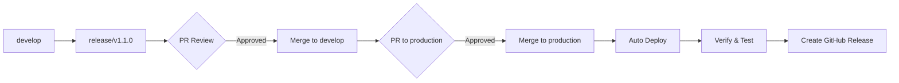

# 🚀 Guía de Deployment - Release v1.1.0

## ✅ Completado

- [x] Commit de todos los cambios con mensaje descriptivo
- [x] Creación de tag de versión `v1.1.0`
- [x] Creación de rama `release/v1.1.0`
- [x] Push de la rama de release a GitHub
- [x] Push del tag v1.1.0 a GitHub
- [x] Generación de Release Notes completos

---

## 📋 Pasos Siguientes para Deployment a Production

### 1. Crear Pull Request a Develop (Si aplica)

Si necesitas mergear primero a `develop`:

```bash
# Ir a GitHub y crear PR de release/v1.1.0 → develop
# URL: https://github.com/jeancdevx/dumi-gestion-interna/pull/new/release/v1.1.0
```

**O puedes hacerlo directamente desde la terminal usando GitHub CLI:**

```bash
gh pr create --base develop --head release/v1.1.0 --title "Release v1.1.0: Orders Management Module" --body-file RELEASE_NOTES.md
```

### 2. Crear Pull Request a Production

Una vez que el PR a develop esté aprobado (o directamente si no es necesario):

**Opción A: Desde GitHub Web**

1. Ve a: https://github.com/jeancdevx/dumi-gestion-interna/pulls
2. Click en "New Pull Request"
3. Base: `production` ← Compare: `release/v1.1.0`
4. Título: `Release v1.1.0: Orders Management Module & Enhancements`
5. Descripción: Copia el contenido de `RELEASE_NOTES.md`
6. Solicita revisión del equipo
7. Una vez aprobado, haz merge a production

**Opción B: Desde GitHub CLI**

```bash
gh pr create --base production --head release/v1.1.0 --title "Release v1.1.0: Orders Management Module" --body-file RELEASE_NOTES.md
```

### 3. Verificar el Deployment Automático

Si tienes CI/CD configurado (Vercel, GitHub Actions, etc.):

1. Una vez mergeado a `production`, el deployment debería iniciarse
   automáticamente
2. Monitorea el proceso en:
   - Vercel Dashboard: https://vercel.com/dashboard
   - GitHub Actions: https://github.com/jeancdevx/dumi-gestion-interna/actions

### 4. Crear GitHub Release (Opcional pero Recomendado)

**Opción A: Desde GitHub Web**

1. Ve a: https://github.com/jeancdevx/dumi-gestion-interna/releases
2. Click en "Draft a new release"
3. Choose tag: `v1.1.0`
4. Release title: `v1.1.0 - Orders Management Module & Enhancements`
5. Description: Copia el contenido de `RELEASE_NOTES.md`
6. Click "Publish release"

**Opción B: Desde GitHub CLI**

```bash
gh release create v1.1.0 --title "v1.1.0 - Orders Management Module & Enhancements" --notes-file RELEASE_NOTES.md
```

### 5. Verificación Post-Deployment

Una vez desplegado a production:

#### A. Verificar la Aplicación

- [ ] Acceder a la URL de production
- [ ] Verificar que carga correctamente
- [ ] Login con usuario de prueba
- [ ] Verificar módulo de órdenes está disponible

#### B. Smoke Tests

- [ ] Crear una prenda con precio adicional
- [ ] Agregar items al carrito y verificar total
- [ ] Crear una cotización
- [ ] Verificar badges de colores en cotizaciones
- [ ] Crear una orden desde cotización pendiente
- [ ] Verificar que la fecha de entrega tiene validación

#### C. Verificar Métricas

- [ ] Revisar logs de errores (Sentry, CloudWatch, etc.)
- [ ] Verificar métricas de performance
- [ ] Revisar analytics de usuarios

### 6. Notificaciones al Equipo

Una vez verificado el deployment:

```markdown
📢 **Release v1.1.0 Desplegado a Production**

✅ Estado: Exitoso 🔗 URL: [URL de production] 📅 Fecha: 9 de Octubre, 2025 📝
Release Notes:
https://github.com/jeancdevx/dumi-gestion-interna/releases/tag/v1.1.0

**Nuevas Funcionalidades:**

- Módulo de Órdenes de Producción completo
- Precios adicionales por variante de prenda
- Badges con colores para estados de cotización
- Mejoras de rendimiento y UX

**Próximos Pasos:**

- Capacitación al equipo sobre nuevas funcionalidades
- Monitoreo de métricas y feedback de usuarios
```

### 7. Limpiar Ramas (Post-Deployment)

Después de que todo esté verificado y funcionando:

```bash
# Volver a develop
git checkout develop

# Actualizar develop con los cambios de production
git pull origin develop

# Eliminar rama de release local
git branch -d release/v1.1.0

# Eliminar rama de release remota (opcional, después de merge)
git push origin --delete release/v1.1.0
```

---

## 🔄 Workflow Completo Resumido



---

## 📞 Contactos de Emergencia

Si algo sale mal durante el deployment:

1. **Rollback Rápido**:

   ```bash
   # Volver a la versión anterior en production
   git checkout production
   git revert HEAD
   git push origin production
   ```

2. **Contactar al equipo**:
   - Lead Developer: [Nombre]
   - DevOps: [Nombre]
   - QA Lead: [Nombre]

---

## 📊 Checklist Final

Antes de considerar el release completado:

- [ ] PR a develop creado y aprobado
- [ ] PR a production creado y aprobado
- [ ] Merge a production completado
- [ ] Tag v1.1.0 en production
- [ ] GitHub Release publicado
- [ ] Deployment automático exitoso
- [ ] Smoke tests pasados
- [ ] Métricas estables
- [ ] Equipo notificado
- [ ] Documentación actualizada
- [ ] Ramas limpiadas

---

## 🎯 Siguientes Releases

Para el próximo sprint (v1.2.0):

- Página de detalle de órdenes
- Sistema de actualización de estados
- Aprobación/rechazo de cotizaciones
- Dashboard con métricas

---

**¡Felicitaciones por el release! 🎉**
